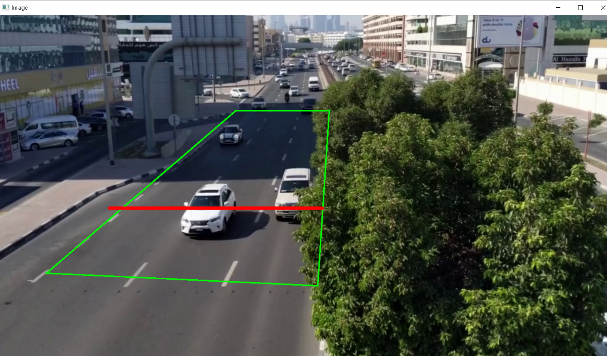
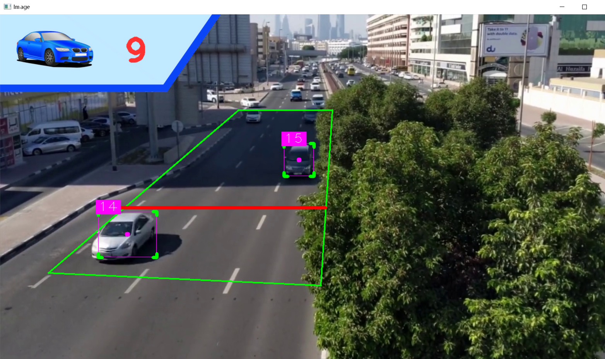

# CarCounterApplication
 Python application to count the number of cars in frame applied YOLO models.  
This application allows user to set the detected zone before running video stream by drawing directly on image.  

## Setup
- Install python3 and anaconda for openCV.  
- Setup virtual environment in anaconda
- To install necessary library  
`pip install -r requirements.txt`
## Run
`python3 Carcounter.py`
## Use app
- To draw detection zone on image, use left mouse. 
- To drag the point, use left mouse to choose and drag to other location
- To delete a point, use right mouse, application will choose the nearest point to delete
- After finishing draw detection zone, press **b** to run streaming video.

